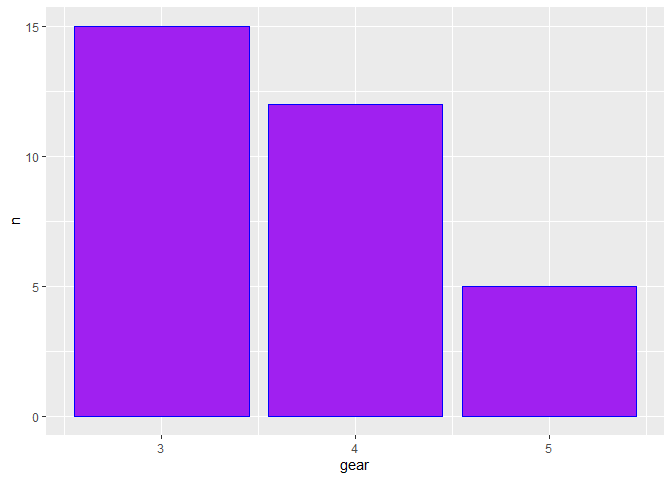

Pre-class 1 Exercises
---------------------

The warm-up for class will use the mtcars dataset which is always
present in R. The following code shows you how load the dataset

``` r
pacman::p_load(pacman, tidyverse) #load packages
? mtcars # what are the variables
```

    ## starting httpd help server ... done

``` r
cars <- mtcars %>% rownames_to_column(var = "type") # tranform to tibble
```

This a brief re-introduction to the tidyverse package in R

This is something we went through during 1st semester so you should be
able to do it, however if the summer have been to harsh I recommend
consulting R for data science chapter 5:
<a href="https://r4ds.had.co.nz" class="uri">https://r4ds.had.co.nz</a>

``` r
#Using mutate - convert miles per gallon to liters
cars <- mutate(cars, mpl = mpg * 0.264172052)

# Using filter - find all the cars which have more that 4 gears and are automatic
cars_gorautom <- filter(cars, gear>4 | am==0)

cars_gandautom <- filter(cars, gear>4 & am==0)

# Using select - create a column dataframe with only miles pr. gallon, weight and number og gears
cars_selected <- select(cars, mpg, wt, gear)

# Using arrange - What cars are most fuel efficient? (lowest miles pr. liter/gallon)
cars_arranged <- arrange(cars, mpg)

# Using Group_by and summarise - Find out how many cars have 3 gears, how many have 4 and how many have 5 (tip use n(), with summarise to count number of occurences)
cars_grouped <- cars %>% group_by(gear) %>% 
  summarize(n = n())

# If you haven't yet, solve the above task using pipe, they look like this '%>%' and can be read as 'then' e.g. the following lines:
mtcars %>% 
  mutate(number = 200) %>% 
  summarise(sum_num = sum(number)) %>% 
  mutate(n_row = sum_num / 200)
```

    ##   sum_num n_row
    ## 1    6400    32

``` r
# can be read as 'take mtcars, 
  # THEN add a column called numbers which is equal to 200
  # THEN the summarise the using the sum of numbers 
  # THEN divide the sum of the number by 200 to get the number of rows

#create some sort of plot plotting the data
cars_plot <- ggplot(cars_grouped, aes(x=gear, y=n)) + geom_bar(stat = "identity", color="blue", fill="purple")
cars_plot
```


